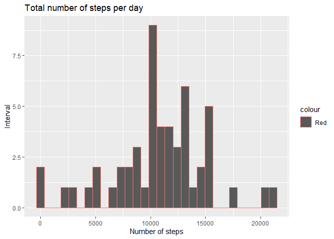
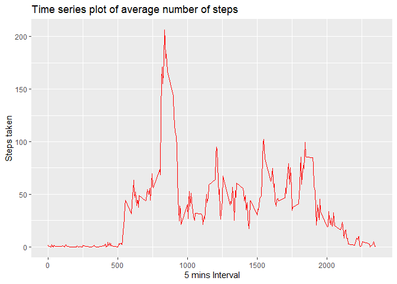
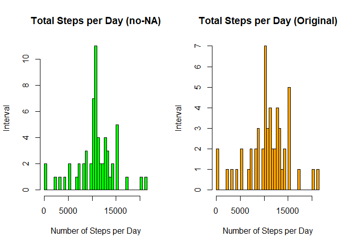
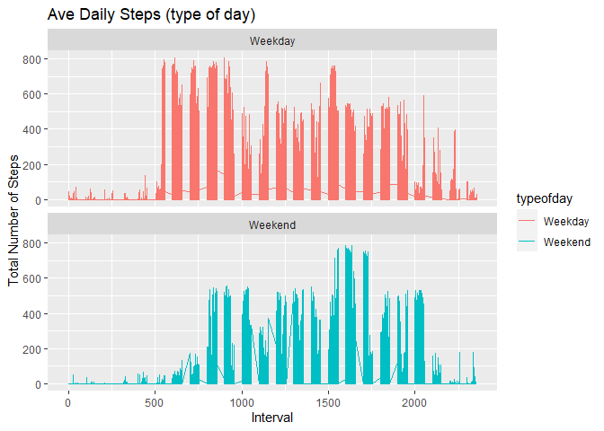

# Loading and preprocessing the data

```r
  filename <- "activity.csv"
  
  if(!file.exists(filename))
    {
      download.file("https://d396qusza40orc.cloudfront.net/repdata%2Fdata%2Factivity.zip",destfile="activity.zip")
      unzip(filename)
      activity <- read.csv(filename)
    }
    
  activity <- read.csv(filename)
  str(activity)
```

```
## 'data.frame':	17568 obs. of  3 variables:
##  $ steps   : int  NA NA NA NA NA NA NA NA NA NA ...
##  $ date    : Factor w/ 61 levels "2012-10-01","2012-10-02",..: 1 1 1 1 1 1 1 1 1 1 ...
##  $ interval: int  0 5 10 15 20 25 30 35 40 45 ...
```

```r
  head(activity)
```

```
##   steps       date interval
## 1    NA 2012-10-01        0
## 2    NA 2012-10-01        5
## 3    NA 2012-10-01       10
## 4    NA 2012-10-01       15
## 5    NA 2012-10-01       20
## 6    NA 2012-10-01       25
```
# What is mean total number of steps taken per day?

## Histogram of the total number of steps taken each day

```r
library(dplyr)
```

```
## 
## Attaching package: 'dplyr'
```

```
## The following objects are masked from 'package:stats':
## 
##     filter, lag
```

```
## The following objects are masked from 'package:base':
## 
##     intersect, setdiff, setequal, union
```

```r
library(ggplot2)
act <- aggregate(steps ~ date, data=activity, sum, na.rm=TRUE)

head(act)
```

```
##         date steps
## 1 2012-10-02   126
## 2 2012-10-03 11352
## 3 2012-10-04 12116
## 4 2012-10-05 13294
## 5 2012-10-06 15420
## 6 2012-10-07 11015
```

```r
activity$date <- as.Date(activity$date, "%Y-%m-%d")

qplot(steps,data=act,color="Red",xlab = "Number of steps", ylab="Interval", main="Total number of steps per day")
```

```
## `stat_bin()` using `bins = 30`. Pick better value with `binwidth`.
```

<!-- -->

## Mean and median total number of steps taken per day

```r
meansteps<-mean(act$steps)
```

```r
mediansteps<-median(act$steps)
```

## What is the average daily activity pattern?

# Time series plot of the average number of steps taken


```r
stepinterval <- aggregate(steps~interval, data=activity, mean, na.rm=TRUE)

head(stepinterval)
```

```
##   interval     steps
## 1        0 1.7169811
## 2        5 0.3396226
## 3       10 0.1320755
## 4       15 0.1509434
## 5       20 0.0754717
## 6       25 2.0943396
```

```r
qplot(x = interval,
      y = steps, 
      data = stepinterval,
      geom = "line",
      colour = I("red"), 
      xlab = "5 mins Interval",
      ylab = "Steps taken",
      main = "Time series plot of average number of steps")
```

<!-- -->
# Which 5-minute interval, on average across all the days in the dataset, contains the maximum number of steps?

```r
maxsteps <- stepinterval$interval[which.max(stepinterval$steps)]
maxsteps
```

```
## [1] 835
```

## Imputing missing values

# Calculate and report the total number of missing values in the dataset (i.e. the total number of rows with NAs)

```r
nas <- sum(is.na(activity$steps))
nas
```

```
## [1] 2304
```
# Strategy for filling in missing values.

Devise a strategy for filling in all of the missing values in the dataset. The strategy does not need to be sophisticated. For example, you could use the mean/median for that day, or the mean for that 5-minute interval, etc.
Create a new dataset that is equal to the original dataset but with the missing data filled in.


```r
activity2 <- activity
isna <- is.na(activity2$steps) 
avg_interval <- tapply(activity2$steps, activity2$interval, mean, na.rm=TRUE, simplify = TRUE)
activity2$steps[isna] <- avg_interval[as.character(activity2$interval[isna])]

sum(is.na(activity2))
```

```
## [1] 0
```

```r
act2 <- aggregate(steps ~ date, data = activity2, FUN = sum, na.rm = TRUE)
par(mfrow=c(1,2))

## Histogram without the NA values
hist(act2$steps, 
    main = "Total Steps per Day (no-NA)", 
    xlab = "Number of Steps per Day", 
    ylab = "Interval",
    col="green",
    breaks=50)
##Histogram with the orginal dataset
hist(act$steps, 
    main="Total Steps per Day (Original)", 
    xlab="Number of Steps per Day", 
    ylab = "Interval",
    col="orange",
    breaks=50)
```

<!-- -->
## Are there differences in activity patterns between weekdays and weekends?

Create a new factor variable in the dataset with two levels – “weekday” and “weekend” indicating whether a given date is a weekday or weekend day.

```r
par(mfrow=c(1,1))

activity2<- activity2%>%
        mutate(typeofday= ifelse(weekdays(activity2$date)=="Saturday" | weekdays(activity2$date)=="Sunday", "Weekend", "Weekday"))
        
head(activity2)
```

```
##       steps       date interval typeofday
## 1 1.7169811 2012-10-01        0   Weekday
## 2 0.3396226 2012-10-01        5   Weekday
## 3 0.1320755 2012-10-01       10   Weekday
## 4 0.1509434 2012-10-01       15   Weekday
## 5 0.0754717 2012-10-01       20   Weekday
## 6 2.0943396 2012-10-01       25   Weekday
```
Make a panel plot containing a time series plot (i.e. type = “l”) of the 5-minute interval (x-axis) and the average number of steps taken, averaged across all weekday days or weekend days (y-axis).

```r
fivemin2<- aggregate(steps ~ interval, data = activity2, FUN = mean, na.rm = TRUE)
head(fivemin2)
```

```
##   interval     steps
## 1        0 1.7169811
## 2        5 0.3396226
## 3       10 0.1320755
## 4       15 0.1509434
## 5       20 0.0754717
## 6       25 2.0943396
```

```r
ggplot(activity2, aes(x =interval , y=steps, color=typeofday)) +
       geom_line() +
       labs(title = "Ave Daily Steps (type of day)", x = "Interval", y = "Total Number of Steps") +
       facet_wrap(~ typeofday, ncol = 1, nrow=2)
```

<!-- -->
